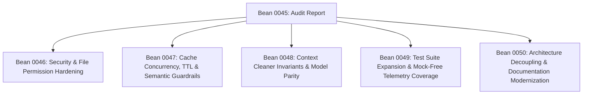

# Technical Audit Report: holon-coherence Architecture, Security & Reliability

- **Audit ID:** AUDIT-HOLON-COHERENCE-2026-10-07
- **Parent Bean:** Bean 0045 (Comprehensive Architecture, Security, and Quality Audit)
- **Target Repository:** `holon-coherence`
- **Audit Date:** 2026-10-07
- **Auditor:** antigravity-agent / Gemini 3.8 Flash
- **Status:** COMPLETED

---

## 1. Executive Summary & Scope Overview

### 1.1 Executive Summary

This audit delivers an exhaustive architectural, security, concurrency, reliability, and test pipeline evaluation of the
`holon-coherence` repository. `holon-coherence` serves as an optimization gateway and MITM proxy sidecar designed to
minimize LLM token consumption for autonomous fractal coding agents through context cleaning, tool output deduplication,
prompt cache optimization, and local response caching.

The audit identified **16 discrete findings** across the codebase. While the core networking primitives, Docker gateway
routing, and CA validation mechanisms demonstrate thoughtful defensive engineering, significant vulnerabilities and
technical debt were uncovered:

1. **Security & Data Isolation**: Wire logs (`transactions.jsonl`) and the SQLite cache database are persisted with
   default permissions (`0644`), creating potential information disclosure risks in multi-user environments. `Makefile`
   automation includes unverified `curl | sudo sh` scripts.
2. **Operational Concurrency & Memory**: Addon metrics counters suffer from race conditions under multi-threaded proxy
   flows; SSE stream buffers allow unbounded in-memory accumulation up to 50MB per flow before silently truncating wire
   logging data; and `HybridCacheStore` lacks TTL expiration, LRU bounds, and thread synchronization.
3. **Prompt & Context Invariants**: History summarization creates dangling references when deduplicated tool outputs
   point to turns pruned by subsequent summarization passes, and risks violating Anthropic `tool_use`/`tool_result`
   pairing requirements. Naive bag-of-words Jaccard similarity in semantic caching poses severe false-positive hit risks
   for code generation.
4. **Testing Hygiene & Architecture**: Over 1,500 lines of critical proxy and indexer logic (`mitm_addon.py`,
   `rag_indexer.py`) lack dedicated unit and integration tests. Core documentation in `docs/methods/` exhibits
   substantial architectural drift, referencing obsolete paths from the legacy monorepo.

### 1.2 Audit Scope

The inspection covered all source files, documentation, test suites, container definitions, and build scripts:

| Scope Dimension         | Inspected Components                                                                                                                                                                                         |
| :---------------------- | :----------------------------------------------------------------------------------------------------------------------------------------------------------------------------------------------------------- |
| **Core Source Code**    | `src/holon_coherence/__init__.py`, `ca_generator.py`, `cli.py`, `host_local.py`, `hybrid_cache.py`, `mitm_addon.py`, `openbrain_memory.py`, `payload_cleaner.py`, `rag_indexer.py`, `ringer_orchestrator.py` |
| **Architecture & Docs** | `docs/token_reduction_architecture.md`, `docs/methods/*.md` (all 6 guides), `docs/mitm_telemetry_metrics_plan.md`, `docs/token_reduction_measurement_plan.md`, `README.md`, `AGENTS.md`                      |
| **Test Suite**          | `tests/test_cli.py`, `tests/test_coherence.py`, `tests/test_host_local.py`, `tests/test_docker_integration.py`, `tests/test_build_image.py`, `tests/test_makefile.py`                                        |
| **Build & Packaging**   | `Dockerfile`, `docker-bake.hcl`, `Makefile`, `build_image.sh`, `pyproject.toml`, `environment.yml`                                                                                                           |

### 1.3 Findings Severity Matrix

| Severity     | Count | Summary of Key Issues                                                                                                                                                                                                                                                                                                                             |
| :----------- | :---: | :------------------------------------------------------------------------------------------------------------------------------------------------------------------------------------------------------------------------------------------------------------------------------------------------------------------------------------------------ |
| **Critical** |   0   | None identified.                                                                                                                                                                                                                                                                                                                                  |
| **High**     |   5   | Insecure wire log / DB file permissions; Unchecked `curl \| sudo sh` in Makefile; Dangling turn references in context cleaner; Severe unit test coverage vacuum in `mitm_addon.py`; Fragile bag-of-words semantic cache matching.                                                                                                                 |
| **Medium**   |   7   | Monolithic modules (`cli.py`, `mitm_addon.py`); Race conditions in proxy telemetry counters; Memory bloat & silent truncation in SSE streaming; Inefficient deserialization & missing TTL in SQLite cache; Missing runtime dependency declaration (`mitmproxy`); Widespread legacy path drift in docs; Anthropic tool call pairing breakage risk. |
| **Low**      |   4   | Silent error suppression in CA PEM synchronization; RSA-2048 instead of modern RSA-4096 / P-256; Unconnected standalone modules (`openbrain`, `rag_indexer`); Hardcoded model IDs in `RingerOrchestrator`.                                                                                                                                        |

---

## 2. Architectural Assessment & Modularity

### 2.1 Monolithic Architecture & Bloated Modules

- **Severity:** Medium
- **Affected Files:**
  - [`src/holon_coherence/mitm_addon.py`](../src/holon_coherence/mitm_addon.py#L1-L1461) (1,461 lines)
  - [`src/holon_coherence/cli.py`](../src/holon_coherence/cli.py#L1-L1463) (1,463 lines)
- **Description:** Both `mitm_addon.py` and `cli.py` violate the Single Responsibility Principle by accumulating
  heterogeneous concerns into single files:
  - `mitm_addon.py` combines mitmproxy lifecycle hooks, SSE token parsers for Anthropic/OpenAI/Gemini, character
    heuristics, telemetry math (TTFT, prefill TPS, decode TPS), async thread pool orchestration, transaction JSON/JSONL
    serialization, and network route rewrites.
  - `cli.py` bundles argparse definitions, Docker daemon lifecycle management (`start`, `stop`, `status`, `logs`,
    `build`), Root CA initialization, interactive TTY process spawning with signal trapping, host gateway probe scripts,
    and multi-agent wrapper execution.
- **Architectural Impact:** High coupling prevents isolated unit testing, increases maintenance burden, and complicates
  independent reuse of telemetry or parser logic outside of mitmproxy.
- **Recommendation:** Decompose `mitm_addon.py` into dedicated submodules:
  - `holon_coherence.telemetry.parsers` (SSE stream parsers, token counting)
  - `holon_coherence.telemetry.logger` (wire log writer and thread pool)
  - `holon_coherence.proxy.addon` (core mitmproxy event hooks) Decompose `cli.py` into:
  - `holon_coherence.cli.commands` (subcommand handlers)
  - `holon_coherence.cli.docker_mgr` (container management)
  - `holon_coherence.cli.process_runner` (interactive stdio and signal forwarding)

### 2.2 Orphaned Subsystems & Disconnected Pipelines

- **Severity:** Low
- **Affected Files:**
  - [`src/holon_coherence/openbrain_memory.py`](../src/holon_coherence/openbrain_memory.py#L1-L130)
  - [`src/holon_coherence/rag_indexer.py`](../src/holon_coherence/rag_indexer.py#L1-L121)
  - [`src/holon_coherence/ringer_orchestrator.py`](../src/holon_coherence/ringer_orchestrator.py#L1-L82)
- **Description:** `OpenBrainMemory`, `RAGCodebaseIndexer`, and `RingerOrchestrator` are exported in
  [`src/holon_coherence/__init__.py`](../src/holon_coherence/__init__.py#L1-L20) and documented in
  [`docs/token_reduction_architecture.md`](token_reduction_architecture.md#L107-L120) as Phase 4 components. However,
  neither `mitm_addon.py` nor `cli.py` ever instantiates or interacts with them. They exist as disconnected standalone
  libraries without any integration into the proxy pipeline or agent execution workflow.
- **Architectural Impact:** Misleading architecture where features documented as part of the token reduction pipeline
  are non-operational in actual proxy execution.
- **Recommendation:** Either integrate these components into the agent lifecycle (e.g. injecting RAG bootstrap context
  or OpenBrain memory via CLI hooks prior to agent invocation) or clearly document them as standalone experimental
  utilities.

### 2.3 Hardcoded Model Identifiers in Ringer Orchestrator

- **Severity:** Low
- **Affected Files:**
  - [`src/holon_coherence/ringer_orchestrator.py`](../src/holon_coherence/ringer_orchestrator.py#L38-L40)
- **Description:** `RingerOrchestrator.__init__` specifies hardcoded default models:
  ```python
  def __init__(
      self,
      architect_model: str = "claude-3-5-sonnet",
      executor_model: str = "gemini-3.5-flash",
  ):
  ```
  This violates the repository invariant documented in
  [`docs/methods/context_cleaning.md`](methods/context_cleaning.md#L92-L95): _"Dynamic Model Discovery (Zero Hardcoded
  Models): In compliance with repository invariants, never hardcode model identifiers. Query the live active catalog via
  `agy models`."_
- **Recommendation:** Remove hardcoded default model strings or parameterize them to dynamically resolve via environment
  configuration or CLI arguments.

### 2.4 Documentation Drift & Legacy Monorepo Path References

- **Severity:** Medium
- **Affected Files:**
  - [`docs/methods/context_cleaning.md`](methods/context_cleaning.md#L84-L85)
  - [`docs/methods/local_cache_layer.md`](methods/local_cache_layer.md#L27-L28)
  - [`docs/methods/openbrain_memory.md`](methods/openbrain_memory.md#L31-L32)
  - [`docs/methods/prompt_cache_optimization.md`](methods/prompt_cache_optimization.md#L84)
  - [`docs/methods/rag_codebase_indexer.md`](methods/rag_codebase_indexer.md#L29-L30)
  - [`docs/methods/ringer_framework.md`](methods/ringer_framework.md#L29-L30)
  - [`docs/token_reduction_measurement_plan.md`](token_reduction_measurement_plan.md#L23)
  - [`docs/mitm_telemetry_metrics_plan.md`](mitm_telemetry_metrics_plan.md#L6)
- **Description:** Across all six methodology guides in `docs/methods/` and the measurement plans, file paths and Python
  import statements point to the old monolith layout:
  ```markdown
  `apps/sandbox-executor/src/sandbox_executor/token_reduction/payload_cleaner.py` from sandbox_executor.token_reduction
  import JSONContextCleaner
  ```
  Furthermore, [`docs/mitm_telemetry_metrics_plan.md`](mitm_telemetry_metrics_plan.md#L6) contains an absolute local
  user path: `file:///Users/thomashan/git/holon-agentic-coder-ref-metadata/...`
- **Architectural Impact:** Breaks automated documentation verification, confuses developers and agents attempting to
  follow the guides, and introduces dead file links.
- **Recommendation:** Perform a repository-wide documentation refactoring updating all paths to `src/holon_coherence/`
  and imports to `from holon_coherence import ...`. Strip all absolute local file paths.

---

## 3. Security & Trust Boundary Review

### 3.1 Insecure Permissions on Wire Logs and Cached LLM Payloads

- **Severity:** High
- **CWE:** CWE-732 (Incorrect Permission Assignment for Critical Resource)
- **Affected Files:**
  - [`src/holon_coherence/mitm_addon.py`](../src/holon_coherence/mitm_addon.py#L194-L206)
  - [`src/holon_coherence/hybrid_cache.py`](../src/holon_coherence/hybrid_cache.py#L38-L42)
  - [`src/holon_coherence/ca_generator.py`](../src/holon_coherence/ca_generator.py#L221)
- **Description:** In `mitm_addon.py`, `_write_transaction_sync` creates wire log dumps:

  ```python
  with open(tmp_filepath, "w", encoding="utf-8") as f:
      json.dump(record, f, indent=2, ensure_ascii=False, default=str)
  os.replace(tmp_filepath, filepath)

  with open(jsonl_path, "a", encoding="utf-8") as f:
      f.write(line)
  ```

  These files are opened with default umask without setting `0o600` (owner read/write only). In `hybrid_cache.py`,
  `llm_cache.db` is initialized by `sqlite3.connect()` without permission tightening. In `ca_generator.py`,
  `os.makedirs(cert_dir, exist_ok=True)` creates `~/.holon/certs` without setting `0o700` mode.

- **Security Impact:** Wire logs capture full prompt messages, tool outputs, and LLM responses. If the proxy runs on a
  shared host or shared volume, other local users or unprivileged processes can inspect sensitive conversation contents,
  code snippets, or proprietary prompts.
- **Recommendation:**
  1. Open wire log files using `os.open(path, os.O_WRONLY | os.O_CREAT | ..., 0o600)`.
  2. Enforce `os.chmod(self.db_path, 0o600)` in `HybridCacheStore._init_db()`.
  3. Enforce `os.chmod(cert_dir, 0o700)` in `ca_generator.py`.

### 3.2 Insecure Remote Script Execution with `sudo` in Makefile

- **Severity:** High
- **CWE:** CWE-494 (Download of Code Without Integrity Check), CWE-250 (Execution with Unnecessary Privileges)
- **Affected Files:**
  - [`Makefile`](../Makefile#L78-L81)
  - [`Makefile`](../Makefile#L54)
- **Description:** The `install-docker` target downloads an external script directly from `https://get.docker.com` and
  executes it under `sudo`:
  ```makefile
  TMP_SCRIPT=$$(mktemp /tmp/get-docker-XXXXXX.sh); \
  curl -fsSL https://get.docker.com -o "$$TMP_SCRIPT" || exit 1; \
  sudo sh "$$TMP_SCRIPT" || exit 1; \
  rm -f "$$TMP_SCRIPT";
  ```
  Similarly, `install-homebrew` executes `curl -fsSL https://raw.githubusercontent.com/... | /bin/bash`. Neither target
  verifies a cryptographic SHA-256 hash or signature prior to privileged execution.
- **Security Impact:** Any network interception (DNS poisoning, MITM on outbound traffic, or compromised CDN origin)
  leads directly to arbitrary root code execution on the host machine.
- **Recommendation:** Remove automated `sudo` script execution from `Makefile`. Require users to install Docker through
  their official distribution package managers (`apt`, `dnf`, `brew cask`) with verified package signatures, or enforce
  strict pre-pinned SHA-256 verification before running downloaded scripts (as is already done for Miniforge in lines
  125-126 of `Makefile`).

### 3.3 Silent Error Suppression in CA Combined PEM Synchronization

- **Severity:** Low
- **CWE:** CWE-390 (Detection of Error Condition Without Action)
- **Affected Files:**
  - [`src/holon_coherence/ca_generator.py`](../src/holon_coherence/ca_generator.py#L198-L207)
- **Description:** In `_sync_mitmproxy_ca`, file writing is wrapped in `with contextlib.suppress(OSError):`:
  ```python
  with contextlib.suppress(OSError):
      with open(ca_key_path, encoding="utf-8") as kf, open(ca_cert_path, encoding="utf-8") as cf:
          combined = f"{kf.read().strip()}\n{cf.read().strip()}\n"
      pem_fd = os.open(mitm_ca_pem, os.O_WRONLY | os.O_CREAT | os.O_TRUNC, 0o600)
      with os.fdopen(pem_fd, "w", encoding="utf-8") as pf:
          pf.write(combined)
  ```
- **Security Impact:** If disk quota is exhausted or permission denies writing `mitmproxy-ca.pem`, the function silently
  completes. The caller believes Root CA initialization succeeded, but subsequent mitmproxy startup fails or falls back
  to an unmanaged internal CA, breaking downstream client trust.
- **Recommendation:** Log the failure or allow `OSError` to propagate into an actionable `RuntimeError`.

### 3.4 Root CA Key Algorithm Standard

- **Severity:** Low
- **Affected Files:**
  - [`src/holon_coherence/ca_generator.py`](../src/holon_coherence/ca_generator.py#L165)
- **Description:** Root CA private keys are generated with `rsa:2048`:
  ```python
  "-newkey", "rsa:2048"
  ```
  While adequate for temporary test setups, modern security baselines (NIST SP 800-57, BSI TR-02102) recommend RSA
  4096-bit or ECDSA (secp256r1 / prime256v1) for root certificate authorities.
- **Recommendation:** Upgrade key generation to ECDSA (`-newkey ec -pkeyopt ec_paramgen_curve:prime256v1`) or RSA 4096
  for enhanced cryptographic margin and faster TLS handshake performance.

---

## 4. Concurrency, Performance & Bug Detection Audit

### 4.1 Thread Safety & Unsynchronized Addon State

- **Severity:** Medium
- **CWE:** CWE-362 (Concurrent Execution using Shared Resource with Improper Synchronization)
- **Affected Files:**
  - [`src/holon_coherence/mitm_addon.py`](../src/holon_coherence/mitm_addon.py#L1203)
  - [`src/holon_coherence/mitm_addon.py`](../src/holon_coherence/mitm_addon.py#L1239)
- **Description:** In `MitmproxyAddon`:
  ```python
  self.total_requests += 1
  ...
  self.cache_hits += 1
  ```
  Mitmproxy handles HTTP requests concurrently across its event loop / thread worker pools. In Python, `+= 1` is
  non-atomic (compiles to `LOAD_FAST`, `BINARY_OP`, `STORE_FAST`). Under concurrent requests from multiple agent
  subtasks or parallel tool calls, counter updates suffer from race conditions, corrupting telemetry hit rates:
  `hit_rate = self.cache_hits / self.total_requests`
- **Impact:** Erratic or inaccurate cache hit rates reported in telemetry logs and response headers
  (`X-Holon-Cache-Hit-Rate`).
- **Recommendation:** Protect `total_requests` and `cache_hits` with a `threading.Lock()` or use an atomic counter
  primitive.

### 4.2 Dangling Turn References & Context Cleaner Invariant Violation

- **Severity:** High
- **Affected Files:**
  - [`src/holon_coherence/payload_cleaner.py`](../src/holon_coherence/payload_cleaner.py#L157-L158)
  - [`src/holon_coherence/payload_cleaner.py`](../src/holon_coherence/payload_cleaner.py#L234-L265)
- **Description:** When `JSONContextCleaner` deduplicates tool results, it inserts tombstones referencing specific
  historical turns:
  ```python
  item_copy["content"] = f"[Omitted: Tool result content is identical to Turn {prev_turn} ({prev_res})]"
  ```
  However, in Phase 2 of `_clean_anthropic` (lines 110-113), if the conversation history exceeds `max_turns` (default
  30), `_summarize_anthropic_history` executes:
  ```python
  prefix = messages[:1]
  suffix = messages[suffix_idx:]
  middle = messages[1:suffix_idx]
  # middle is replaced with a single summary message
  return [*prefix, summary_msg, *suffix]
  ```
  If `prev_turn` was located inside `middle`, that turn is completely eliminated from the prompt! Later turns in
  `suffix` retain tombstones explicitly citing `Turn 2`, but `Turn 2` does not exist anywhere in the message payload.
- **Bug Impact:** The LLM receives prompt instructions referencing non-existent turns, leading to hallucination,
  confusion, or context misinterpretation during complex coding sessions.
- **Recommendation:**
  1. Re-index turn references during summarization, or
  2. Embed a content excerpt/hash identifier in the tombstone rather than a raw turn index:
     `[Omitted: Tool result content identical to previous result for call_xyz (hash: a1b2c3d4)]`.
  3. Ensure that turns containing canonical targets referenced by subsequent tombstones are never purged without
     resolving the reference.

### 4.3 Anthropic API Tool Use / Tool Result Pairing Breakage Risk

- **Severity:** Medium
- **Affected Files:**
  - [`src/holon_coherence/payload_cleaner.py`](../src/holon_coherence/payload_cleaner.py#L234-L265)
- **Description:** The Anthropic Messages API strictly enforces the invariant that every `assistant` message containing
  a `tool_use` content block must be immediately followed by a `user` message containing a corresponding `tool_result`
  content block. In `_summarize_anthropic_history`, the algorithm searches for a clean user message to begin `suffix`:
  ```python
  for i in range(target_idx, 0, -1):
      if self._is_clean_user_message(messages[i], "anthropic"):
          suffix_idx = i
          break
  ```
  `_is_clean_user_message` returns `True` only for user messages _without_ tool results. However, if
  `messages[suffix_idx]` is preceded by an `assistant` message in `middle` that invoked a tool, or if the summarized
  `middle` ends with an unresolved `tool_use`, the API call fails with:
  `400 {"type": "error", "error": {"type": "invalid_request_error", "message": "tool_use blocks must be followed by tool_result blocks"}}`
- **Impact:** Silent transformation of valid agent requests into 400 Bad Request API rejections when conversations
  exceed `max_turns`.
- **Recommendation:** Validate the structural integrity of the boundary between `middle` and `suffix`. Verify that no
  dangling `tool_use` blocks exist in `prefix` or `summary_msg`, and ensure `suffix` does not begin with orphaned
  `tool_result` blocks.

### 4.4 Unbounded Memory Growth and Silent SSE Stream Truncation

- **Severity:** Medium
- **Affected Files:**
  - [`src/holon_coherence/mitm_addon.py`](../src/holon_coherence/mitm_addon.py#L40)
  - [`src/holon_coherence/mitm_addon.py`](../src/holon_coherence/mitm_addon.py#L1308-L1313)
- **Description:** In `responseheaders`, `sse_stream_wrapper` buffers streaming chunks:
  ```python
  flow.sse_bytes = getattr(flow, "sse_bytes", 0) + len(chunk)
  if flow.sse_bytes <= _MAX_SSE_BUFFER_BYTES:
      flow.sse_chunks.append(chunk)
  ```
  `_MAX_SSE_BUFFER_BYTES` is set to 50MB (`50 * 1024 * 1024`). If multiple agents run concurrently through the proxy,
  storing up to 50MB per flow in memory creates severe RAM pressure. Worse: if an SSE stream exceeds 50MB, chunks past
  the limit are silently dropped. In `response(flow)`, `b"".join(sse_chunks)` decodes a truncated payload without any
  warning, causing `extract_token_counts` and `extract_sse_content` to fail or record corrupt usage numbers.
- **Impact:** Potential out-of-memory crashes on resource-constrained containers; corrupt telemetry and wire logs for
  large generation outputs.
- **Recommendation:** Parse token usage and content incrementally during the stream inside `sse_stream_wrapper` rather
  than buffering raw binary chunks into memory. Emit a prominent telemetry warning if a stream exceeds safe buffer
  thresholds.

### 4.5 Full Candidate Deserialization and Missing TTL in HybridCacheStore

- **Severity:** Medium
- **Affected Files:**
  - [`src/holon_coherence/hybrid_cache.py`](../src/holon_coherence/hybrid_cache.py#L236-L255)
  - [`src/holon_coherence/hybrid_cache.py`](../src/holon_coherence/hybrid_cache.py#L280-L302)
- **Description:** In `HybridCacheStore.get()`:
  ```python
  cursor.execute(
      "SELECT key, prompt_normalized, response_json FROM prompt_cache WHERE provider = ? ORDER BY created_at DESC LIMIT ?",
      (provider, self.candidate_limit),
  )
  for key, stored_norm, resp_json in rows:
      stored_payload = json.loads(stored_norm)
      ...
  ```
  On every exact cache miss, up to `candidate_limit` (100) JSON blobs are deserialized from SQLite and inspected in
  Python for system prompt identity and token overlap. Furthermore, `HybridCacheStore` has no TTL expiration, max entry
  count, or LRU eviction logic. `llm_cache.db` grows unboundedly on disk.
- **Performance Impact:** Noticeable latency spike (100–300ms) on cache misses while deserializing and tokenizing 100
  historical conversation trees; perpetual disk growth.
- **Recommendation:**
  1. Store pre-extracted system prompt hashes and token sets in dedicated SQLite columns/tables to filter candidates at
     the SQL layer before deserialization.
  2. Implement an automatic TTL (e.g. 7 days) and maximum entry limit (e.g. 5,000 entries) with LRU deletion:
     `DELETE FROM prompt_cache WHERE created_at < ? OR key NOT IN (SELECT key FROM prompt_cache ORDER BY created_at DESC LIMIT 5000)`.

### 4.6 False-Positive Cache Hits from Naive Bag-of-Words Jaccard Matching

- **Severity:** High
- **Affected Files:**
  - [`src/holon_coherence/hybrid_cache.py`](../src/holon_coherence/hybrid_cache.py#L225-L265)
- **Description:** Semantic cache matching extracts word tokens using regex:
  ```python
  target_tokens = set(re.findall(r"\w+", target_user_content.lower()))
  ...
  similarity = len(target_tokens & stored_tokens) / len(target_tokens | stored_tokens)
  ```
  If similarity exceeds `0.85`, the cached response is served directly. A bag-of-words set Jaccard metric ignores:
  - **Negation words**: _"Do not overwrite the existing configuration"_ vs _"Do overwrite the existing configuration"_
    yields ~95% Jaccard similarity.
  - **File paths and line numbers**: Editing `src/foo.py` vs `src/bar.py` in an otherwise similar prompt yields >90%
    similarity.
  - **Command flags**: `rm -rf /tmp/foo` vs `rm -rf /tmp/bar`.
- **Bug Impact:** The proxy serves cached code from a completely different file or action, causing catastrophic code
  corruption or wrong tool actions during agent execution.
- **Recommendation:**
  1. For coding agents, disable semantic cache matching for active editing and execution prompts; restrict it strictly
     to pure informational queries.
  2. If semantic matching is retained, enforce exact match on file paths and command tokens, or compute dense vector
     embeddings with strict cosine thresholds (>0.98) rather than unweighted bag-of-words Jaccard index.

---

## 5. Test Suite, Build Pipeline & CI Quality Assessment

### 5.1 Test Coverage Vacuum in Core Interceptor and Indexer Modules

- **Severity:** High
- **Affected Files:**
  - [`src/holon_coherence/mitm_addon.py`](../src/holon_coherence/mitm_addon.py) (1,461 lines)
  - [`src/holon_coherence/rag_indexer.py`](../src/holon_coherence/rag_indexer.py) (121 lines)
  - [`src/holon_coherence/payload_cleaner.py`](../src/holon_coherence/payload_cleaner.py) (553 lines)
- **Description:** Detailed audit of `tests/` revealed significant coverage gaps:
  - `mitm_addon.py`: Only `server_connect` is mocked in `test_host_local.py`. Zero unit tests exist for `request()`,
    `response()`, `responseheaders()`, `_dump_flow_transaction()`, `extract_token_counts()`, `extract_sse_content()`,
    `extract_sse_token_counts()`, `scrub_headers()`, and `scrub_payload()`.
  - `rag_indexer.py`: Exactly **zero tests** exist in the entire test suite.
  - `payload_cleaner.py`: `test_coherence.py` tests only Anthropic tool deduplication. `_clean_gemini()`,
    `_clean_openai()`, history summarization, and prompt cache injection have no test coverage.
- **Quality Impact:** Core optimization and telemetry code could experience regressions without breaking any test
  assertions.
- **Recommendation:** Create dedicated test suites:
  - `tests/test_mitm_addon.py` (mock mitmproxy flows, test token extraction and scrubbing)
  - `tests/test_rag_indexer.py` (AST symbol parsing and semantic search verification)
  - `tests/test_payload_cleaner.py` (multi-provider cleaning, summarization boundary checks, and cache control
    insertion)

### 5.2 Dependency Misconfiguration in `pyproject.toml`

- **Severity:** Medium
- **Affected Files:**
  - [`pyproject.toml`](../pyproject.toml#L24-L35)
- **Description:** In `pyproject.toml`:

  ```toml
  dependencies = [
      "cryptography==48.0.1",
  ]

  [dependency-groups]
  dev = [
      "mitmproxy==12.2.3",
      "pytest==9.1.1",
      "ruff==0.16.7",
      "taskipy>=1.14.1",
  ]
  ```

  `mitmproxy` is listed under `dev` rather than `project.dependencies`. If `holon-coherence` is packaged and installed
  as a library or installed via `pip install .` on a machine, `mitmproxy` is omitted, causing `mitm_addon.py` imports to
  fail.

- **Recommendation:** Move `mitmproxy==12.2.3` into `project.dependencies`, or define an optional extra
  `[project.optional-dependencies] proxy = ["mitmproxy==12.2.3"]`.

### 5.3 Non-Hermetic Container Builds in `Dockerfile`

- **Severity:** Medium
- **Affected Files:**
  - [`Dockerfile`](../Dockerfile#L8-L10)
- **Description:** In `Dockerfile`:
  ```dockerfile
  WORKDIR /app
  COPY pyproject.toml README.md /app/
  COPY src/ /app/src/
  RUN pip install --no-cache-dir .
  ```
  The container build executes unpinned `pip install` without utilizing `uv.lock`. This bypasses dependency hash
  locking, creating non-reproducible container builds where upstream dependency updates could silently introduce
  breaking changes.
- **Recommendation:** Install dependencies using `uv` inside the container:
  ```dockerfile
  COPY pyproject.toml uv.lock README.md /app/
  RUN uv sync --frozen --no-dev
  ```

---

## 6. Actionable Remediation Roadmap & Candidate Bean Proposals

To resolve these findings systematically within the Holon fractal governance framework, five dedicated follow-up beans
are proposed:



### Candidate Bean 0046: Security & File Permission Hardening

- **Objective:** Secure wire logs, database files, and build scripts against unauthorized access and privilege
  escalation.
- **Scope:**
  - Enforce `0o600` permissions on `transactions.jsonl`, `turn_*.json`, and `llm_cache.db`.
  - Enforce `0o700` permissions on `~/.holon/certs` directory.
  - Remove unverified `curl | sudo sh` scripts in `Makefile`; replace with distribution package instructions or
    pre-pinned SHA-256 verification.
  - Upgrade Root CA generation to ECDSA (P-256) or RSA-4096.
  - Propagate `OSError` in CA PEM synchronization instead of silent suppression.

### Candidate Bean 0047: Cache Concurrency, TTL & Semantic Guardrails

- **Objective:** Fix multi-threading race conditions and prevent cache corruption in `HybridCacheStore` and
  `MitmproxyAddon`.
- **Scope:**
  - Add thread synchronization lock to `MitmproxyAddon.total_requests` and `cache_hits`.
  - Implement TTL expiration (default 7 days) and LRU size pruning (max 5,000 entries) in SQLite cache.
  - Gate semantic cache retrieval with strict negative-word and file-path equality guards to prevent false-positive code
    replacements.
  - Replace full-candidate JSON deserialization in `get()` with SQL-level indexed filtering.

### Candidate Bean 0048: Context Cleaner Invariant Preservation & Model Parity

- **Objective:** Ensure prompt transformations maintain strict semantic and structural validity across Anthropic,
  Gemini, and OpenAI APIs.
- **Scope:**
  - Fix dangling turn references by embedding durable identifiers in tombstones instead of volatile turn indexes.
  - Enforce Anthropic `tool_use`/`tool_result` pair boundary checks during history summarization.
  - Replace recursive `copy.deepcopy()` in cleaning passes with efficient shallow copying for unaffected messages.
  - Add streaming buffer safeguards with prominent alerts if an SSE stream exceeds buffer thresholds.

### Candidate Bean 0049: Test Suite Expansion & Mock-Free Telemetry Coverage

- **Objective:** Close severe test coverage gaps across proxy interception, indexer AST extraction, and multi-provider
  payload cleaning.
- **Scope:**
  - Author comprehensive test suite `tests/test_mitm_addon.py` covering SSE stream parsing, token count extraction,
    header scrubbing, and response caching.
  - Author `tests/test_rag_indexer.py` covering AST symbol map generation and semantic keyword search.
  - Author `tests/test_payload_cleaner.py` covering Gemini/OpenAI payload processing and prompt cache control injection.
  - Add end-to-end integration tests validating proxy short-circuiting on cache hits.

### Candidate Bean 0050: Architecture Decoupling & Documentation Modernization

- **Objective:** Resolve technical debt, modularize bloated files, and eliminate legacy monorepo path references.
- **Scope:**
  - Decompose `mitm_addon.py` and `cli.py` into focused, single-responsibility submodules.
  - Update all documentation in `docs/methods/` and `docs/token_reduction_measurement_plan.md` to reflect
    `src/holon_coherence/` paths and import signatures.
  - Align `pyproject.toml` dependencies and lock container builds using `uv.lock`.
  - Dynamically resolve model identifiers in `RingerOrchestrator` via `agy models`.
