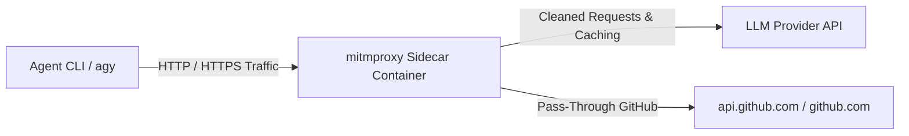

# MITM Sidecar & Agent Startup Guide

This guide details how to start the host `mitmproxy` sidecar container and launch `agy` (or other agent CLIs) to
intercept, clean, and record telemetry metrics for LLM API calls.

---

## 🎯 Architecture Overview


```mermaid
graph LR
    A[Agent CLI / agy] -->|HTTP / HTTPS Traffic| B[mitmproxy Sidecar Container]
    B -->|Cleaned Requests & Caching| C[LLM Provider API]
    B -->|Pass-Through GitHub| D[api.github.com / github.com]
```

- **Proxy Port**: `127.0.0.1:8080`
- **TLS Interception Trust**: `$HOME/.holon/certs/holon-root-ca.crt` (or `mitmproxy-ca-cert.pem`)
- **Pass-Through Endpoints**: `api.github.com`, `github.com` (to ensure git and GitHub CLI operations bypass TLS
  bumping)

---

## 🐳 Step 1: Start the MITM Sidecar Docker Container

### Using `holon-coherence` CLI (Recommended)

Start the proxy container via the CLI:

```bash
holon-coherence start -d
```

To enable the interactive `mitmweb` web dashboard on port `8081`:

```bash
holon-coherence start -d --web --web-port 8081
```

The web dashboard binds to `0.0.0.0` internally inside the container and is exposed safely at `http://127.0.0.1:8081` on
the host.

### Direct Docker Run (Manual)

Alternatively, run the Docker sidecar container directly with `mitmdump` (or `mitmweb`) and the `mitm_addon.py` script:

```bash
docker run --rm --name host-mitm-proxy \
  -p 127.0.0.1:8080:8080 \
  -p 127.0.0.1:8081:8081 \
  -v ~/.holon/proxy-ca:/home/mitmproxy/.mitmproxy:rw \
  -v $(pwd)/apps/sandbox-executor/src:/tmp/src \
  -e PYTHONPATH=/tmp/src \
  -e PYTHONUNBUFFERED=1 \
  -v $(pwd)/apps/sandbox-executor/src/sandbox_executor/token_reduction/mitm_addon.py:/tmp/mitm_addon.py:ro \
  mitmproxy/mitmproxy:12.2.3 \
  mitmdump -s /tmp/mitm_addon.py \
           --listen-port 8080 \
           --set ignore_hosts='^(api\.github\.com|github\.com):443$'
```

> [!TIP] **Enabling Web Dashboard**: When using direct `docker run`, map `-p 127.0.0.1:8081:8081`, replace `mitmdump`
> with `mitmweb`, and pass `--web-host 0.0.0.0 --web-port 8081` to inspect live traffic at `http://127.0.0.1:8081`.

> [!TIP] **Enabling Debug Logging**: Add `-e MITM_DEBUG=1` to the `docker run` command and
> `--set termlog_verbosity=debug --set flow_detail=3` to `mitmdump` to inspect detailed request/response payloads and
> internal proxy debugging logs.

---

## 🚀 Step 2: Launch `agy` (Antigravity CLI) Connected to Proxy

Once the proxy container is running, launch `agy` in your terminal with environment variables directing HTTP/HTTPS
traffic to the proxy, trusting the local Root CA, and bypassing GitHub endpoints:

```bash
HTTP_PROXY="http://127.0.0.1:8080" \
HTTPS_PROXY="http://127.0.0.1:8080" \
http_proxy="http://127.0.0.1:8080" \
https_proxy="http://127.0.0.1:8080" \
NODE_EXTRA_CA_CERTS="$HOME/.holon/proxy-ca/mitmproxy-ca-cert.pem" \
SSL_CERT_FILE="$HOME/.holon/proxy-ca/mitmproxy-ca-cert.pem" \
NO_PROXY="localhost,127.0.0.1,::1,api.github.com,github.com" \
no_proxy="localhost,127.0.0.1,::1,api.github.com,github.com" \
agy
```

---

## 📊 Live Telemetry & Cache Logs

As `agy` sends LLM API requests, `mitmdump` will output real-time telemetry metrics per request:

```text
📊 [TELEMETRY] Provider: GEMINI | Cache: MISS (Hit Rate: 0.0%) | TTFT: 142.5ms | Prefill: 512.30 t/s (2450 tok) | Output: 45.10 t/s (180 tok in 3.99s) | Total: 4132.5ms
```

On a cache hit (e.g. repeated prompt or exact tool output retry):

```text
📊 [TELEMETRY] Provider: GEMINI | Cache: HIT (Hit Rate: 50.0%) | TTFT: 0.00ms | Prefill: 0.00 t/s | Output: 0.00 t/s | Total: 0.00ms
```
