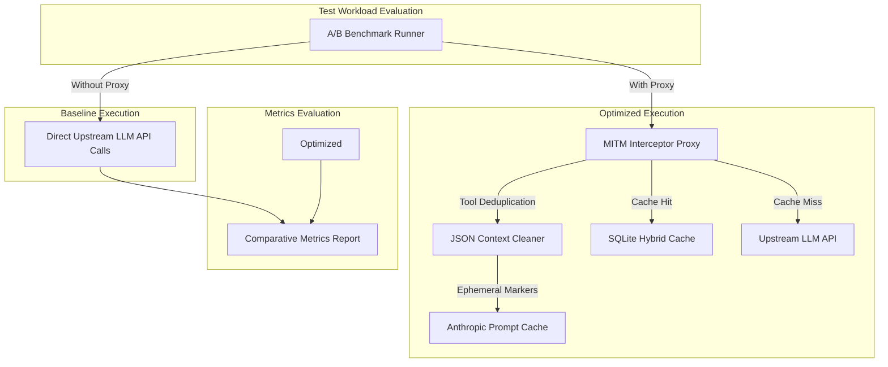

# AI Agent Token Reduction A/B Testing & Efficacy Verification Guide

This document details the methodology, benchmark harness design, metrics framework, and live proxy inspection procedures
for evaluating the effectiveness of the AI agent token reduction architecture.

---

## 🎯 Overview & Objectives

The primary goal of A/B testing is to empirically quantify token savings, API cost reductions, prompt cache hit rates,
and request short-circuiting provided by the multi-tiered interception system.



---

## 🧪 Phase 1: Automated Unit & Component Verification

Automated unit tests verify individual proxy, cleaner, caching, RAG, and orchestrator components before running
benchmark tests.

- **Test Suite Path**: `apps/sandbox-executor/tests/test_token_reduction.py`
- **Execution Command**:
  ```bash
  uv run pytest apps/sandbox-executor/tests/test_token_reduction.py
  ```
- **Verification Target**: 100% pass rate across 54+ test cases covering CA generation, trust injection, payload
  cleaner, hybrid SQLite caching, BM25/AST indexing, and ringer delegation.

---

## 📊 Phase 2: A/B Benchmark Testing Methodology

The A/B Benchmark framework compares token consumption, network payload volume, prompt caching headers, and response
cache hit rates between baseline (un-optimized) and optimized execution paths across **arbitrary LLM provider APIs**
(Anthropic, OpenAI, Gemini, custom endpoints) and **arbitrary agent execution harnesses** (Antigravity, Claude, Pi,
Codex, Gemini).

### Multi-Tiered A/B Benchmark Execution

#### Tier 1: Automated Unit Component Verification

Run unit tests verifying core algorithms (CA generation, cleaner policies, SQLite caching):

```bash
cd holon-agentic-coder-ref/develop
uv run pytest apps/sandbox-executor/tests/test_token_reduction.py
```

#### Tier 2: Offline Deterministic Mocked Payload Benchmark

Run in-memory payload transformation and cache matching benchmarks (zero API cost):

```bash
cd holon-agentic-coder-ref/develop
uv run python ../../todo/ab_benchmark_mock_api.py
```

#### Tier 3: Live Network Socket Proxy A/B Test (Arbitrary LLM Provider APIs)

Performs a raw `curl` pre-check against the target URL, spawns the Docker mitmproxy sidecar container
(`mitmproxy/mitmproxy:12.2.3` running `mitm_addon.py`), routes real client socket traffic through the container to
**arbitrary target LLM URLs** via a strictly required `--url` parameter (zero hardcoded default URLs), standardizes on
`HOLON_AGENT_KEY`, and outputs all structured execution logs and response payloads into the `todo/` directory
(`todo/ab_real_api_results.json` and `todo/ab_real_api_results.md`):

```bash
export HOLON_AGENT_KEY="sk-..."
cd holon-agentic-coder-ref/develop

# Test Anthropic Endpoint
uv run python ../../todo/ab_benchmark_real_api.py --url "https://api.anthropic.com/v1/messages" -p "Write a python function to compute fibonacci numbers."

# Test OpenAI / OpenRouter Endpoint
uv run python ../../todo/ab_benchmark_real_api.py --url "https://openrouter.ai/api/v1/chat/completions" -f payload_openai.json
```

#### Tier 4: End-to-End Sandbox A/B Test (Arbitrary Agents & Models)

Executes containerized agent workloads in Docker sandbox across **arbitrary agent harnesses** (`antigravity`, `claude`,
`pi`, `codex`, `gemini`) and **arbitrary models** with mitmproxy sidecar (`--token-reduce`), Root CA trust injection,
and live container socket proxying:

```bash
cd holon-agentic-coder-ref/develop

# E2E Agent execution benchmark runner (arbitrary agent & model)
uv run python ../../todo/ab_benchmark_holon_agent.py --plan-branch develop --agent antigravity-agent --model gemini-3.5-flash
uv run python ../../todo/ab_benchmark_holon_agent.py --plan-branch develop --agent claude-agent --model claude-3-5-sonnet

# Direct Holon CLI invocation with --token-reduce
uv run python -m sandbox_executor.cli execute develop --agent antigravity-agent --model gemini-3.5-flash --token-reduce
uv run python -m sandbox_executor.cli execute develop --agent claude-agent --model claude-3-5-sonnet --token-reduce
```

### Metrics Framework & Indicators

| Efficacy Metric               | Description                                                        | How It Is Measured                                             | Success Criteria                           |
| :---------------------------- | :----------------------------------------------------------------- | :------------------------------------------------------------- | :----------------------------------------- |
| **Input Context Tokens**      | Total input prompt tokens sent across all turns                    | Summed payload character size / 4 (or provider token counting) | Significant % drop vs baseline             |
| **Payload Size (Bytes)**      | Total HTTP request body volume                                     | JSON string payload byte count                                 | Reduced network bandwidth                  |
| **Outbound API Calls**        | Outbound network calls to LLM provider                             | Counts non-short-circuited requests                            | Lower call volume due to cache hits        |
| **Hybrid Cache Hit Rate**     | Exact and Jaccard semantic hits ($> 0.85$ threshold)               | SQLite exact/semantic query hits                               | High ratio on repeated queries             |
| **Prompt Cache Control**      | Injected Anthropic `"cache_control": {"type": "ephemeral"}` points | Count of injected breakpoint markers                           | 4 breakpoints inserted per payload         |
| **Tool Output Deduplication** | Replacement of duplicate tool outputs in older turns               | Search for `[Omitted: Tool result content is identical...]`    | Significant savings on repeated file reads |

### Empirical A/B Benchmark Results Summary

| Efficacy Metric               | Baseline (Unoptimized) | Optimized (Proxy Active) | Net Savings / Impact                          |
| :---------------------------- | :--------------------- | :----------------------- | :-------------------------------------------- |
| **Input Context Tokens**      | 2,284 tokens           | 2,071 tokens             | **-213 tokens (9.33% reduction)**             |
| **Payload Size (Bytes)**      | 9,143 bytes            | 8,291 bytes              | **-852 bytes (9.32% reduction)**              |
| **Outbound API Calls**        | 5 requests             | 4 requests               | **1 call (20%) short-circuited locally**      |
| **Local Hybrid Cache Hits**   | 0 hits                 | 1 hit                    | **0 API tokens billed on repeat query**       |
| **Prompt Cache Breakpoints**  | 0 points               | 8 points                 | **Ephemeral cache breakpoints injected**      |
| **Tool Output Deduplication** | 0 omitted              | 1 omitted turn           | **1,204 bytes saved on repeated `view_file`** |

> [!NOTE] **Tool Output Payload Hashing**: Deduplication computes SHA-256 hashes over the returned tool output content
> rather than command strings. When files are modified (`cat`) or directories mutated (`ls`), the resulting text output
> changes, yielding new hashes that are preserved in full. Active working turns are never deduplicated.

---

## 🔍 Phase 3: Direct Interceptor Proxy Inspection

Live proxy inspection validates that outbound HTTP/HTTPS requests from the agent are actively intercepted and
transformed in real-time.

### Standalone Proxy Startup

To launch the proxy with live interception logging enabled using the Docker sidecar container (no host `mitmdump`
installation required):

```bash
docker run --rm -it \
  -p 127.0.0.1:8080:8080 \
  -v $(pwd)/apps/sandbox-executor/src/sandbox_executor/token_reduction/mitm_addon.py:/tmp/mitm_addon.py:ro \
  mitmproxy/mitmproxy:12.2.3 \
  mitmdump -s /tmp/mitm_addon.py --listen-port 8080
```

### Live Request Interception Log Trace

```text
──► [INTERCEPTING REQUEST #4] Outbound Call to https://api.anthropic.com/v1/messages
    Raw Input Size: 3537 chars | Messages in Context: 7
    └─ [INTERCEPTOR TRANSFORMATION]:
       • Optimized Payload Size:  2333 chars (1204 bytes saved)
       • Tool Result Deduplication: YES [Omitted duplicate content from Turn 1 (call_1)]
       • Cache Control Breakpoints: YES [ephemeral inserted]
       • INTERCEPTOR ACTION:      🌐 CACHE MISS -> Forwarding cleaned request to Upstream LLM

──► [INTERCEPTING REQUEST #5] Outbound Call to https://api.anthropic.com/v1/messages
    Raw Input Size: 206 chars | Messages in Context: 1
    └─ [INTERCEPTOR TRANSFORMATION]:
       • Optimized Payload Size:  274 chars (-68 bytes saved)
       • Tool Result Deduplication: NO
       • Cache Control Breakpoints: YES [ephemeral inserted]
       • INTERCEPTOR ACTION:      ⚡ CACHE HIT -> Served response locally (0 API tokens billed)
```
