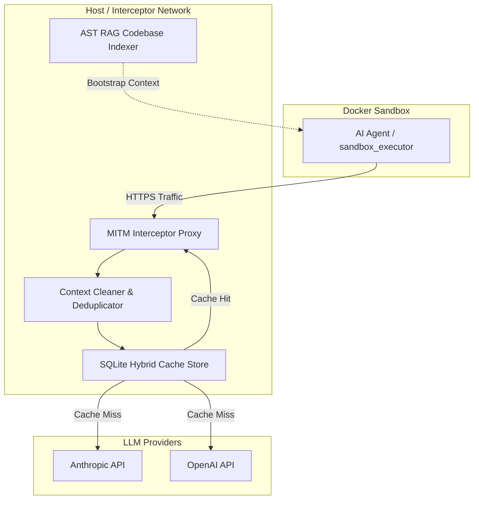

# AI Agent Token Reduction System Architecture

This document describes the design, data flow, and implementation details of the multi-tiered token reduction
architecture.

---

## 🗺️ System Architecture Overview

The system operates as an interception layer between the containerized AI agent running inside the sandbox and the
external LLM API endpoints.



---

## 🔍 Detail by Phase

### Phase 1: MITM Interceptor & SSL/TLS Trust

- **Root CA Generation**: Generates a self-signed Root Certificate Authority (`holon-root-ca.crt`).
- **Trust Injection**: The host CLI automatically mounts the generated Root CA into `/usr/local/share/ca-certificates/`
  inside the target container and configures:
  - `NODE_EXTRA_CA_CERTS` (Node.js/Prettier/TypeScript tools)
  - `REQUESTS_CA_BUNDLE` & `SSL_CERT_FILE` (Python library requests)
  - `CURL_CA_BUNDLE` (cURL command line calls)
- **Proxy Interception**: Outbound requests are routed via `mitmproxy` using a custom scripting addon (`mitm_addon.py`).

---

### Phase 2: JSON Payload Cleaner & Prompt Cache Breakpoints

- **Tool Result Deduplication**: Computes SHA-256 hashes on returned tool output payloads (`tool_result.content`).
  Identical older turns (>100 chars) are replaced with
  `[Omitted: Tool result content is identical to Turn N (call_id)]`. Because hashing evaluates the output text rather
  than the command string, modified files (`cat`) and mutated directory listings (`ls`) produce new hashes and remain
  preserved in full. Recent turns (`_RECENT_TURNS_TO_KEEP = 6`) are never deduplicated to safeguard active working
  context.
- **Anthropic Cache Breakpoints**: Automatically injects `"cache_control": {"type": "ephemeral"}` onto the system prompt
  block, tools definitions block, and the most recent user turn (up to 4 breakpoints total) to trigger cheaper cached
  pricing.
- **Context Summarization**: When the history turn count exceeds the threshold limit, the intermediate turns are
  summarized into a concise summary block, freeing up context space.

---

### Phase 3: Hybrid & Semantic Cache Store

- **Key Normalization**: Before caching, JSON requests are normalized by stripping transient data patterns like UUIDs,
  timestamps, and randomized task IDs.
- **Exact Matching**: Checks the normalized prompt representation in the SQLite database (`llm_cache.db`) for identical
  prompt keys.
- **Semantic Similarity Matching**: If exact match misses, the store executes a token-overlap similarity check (Jaccard
  Index) against all stored entries. Matches above the configured threshold (e.g., `0.85`) are returned as a cache hit,
  handling slight variations in agent phrasing:

  $$\text{Jaccard Similarity}(A, B) = \frac{|A \cap B|}{|A \cup B|}$$

- **Tuple Return & Operational Short-Circuiting**: `MITMProxyInterceptor.intercept_request()` returns a 2-element tuple
  `(cleaned_request_json, cached_response_or_none)`:
  1. **First Element (`cleaned_request_json`)**: The cleaned request body (with deduplicated tool outputs and cache
     control breakpoints).
  2. **Second Element (`cached_response_or_none`)**: The pre-cached LLM response payload served from the local SQLite
     database (`llm_cache.db`), or `None` on a cache miss.

  In `MitmproxyAddon.request(flow)`, when `cached_resp` is present, the proxy short-circuits the HTTP request directly
  on cache hits without sending outbound traffic to LLM provider endpoints:

  ```python
  cleaned_data, cached_resp = self.interceptor.intercept_request(url, data)
  flow.request.set_text(json.dumps(cleaned_data))

  if cached_resp:
      # Serve cached response locally and skip upstream network call
      headers = {"Content-Type": "application/json"}
      flow.response = Response.make(200, json.dumps(cached_resp).encode("utf-8"), headers)
  ```

---

### Phase 4: Codebase RAG & Ringer Delegation

#### AST & BM25 Codebase indexing (RAG)

- Extracts function, class, and class method signatures to build a lightweight symbol directory.
- Limits initial agent prompt injection by providing only relevant symbol summaries rather than printing entire code
  structures.

#### Ringer Orchestrator (Architect/Executor Pattern)

- A high-capability Architect model (e.g. Claude 3.5 Sonnet) designs execution tasks.
- Specific terminal commands, linters, or small edits are delegated to a cheaper, faster Executor model (e.g. Gemini 3.5
  Flash) via the CLI.
- Execution output is summarized and compressed before being returned to the Architect, preventing context window bloat.
