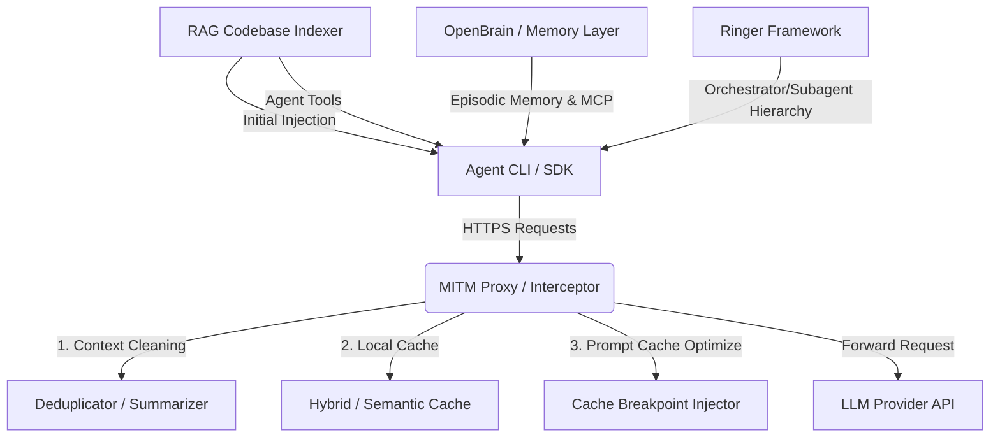

# AI Agent Token Reduction Architecture & Action Plan

This document outlines the architecture, design decisions, and implementation plan for reducing token usage in the
`holon-agentic-coder-ref` execution harness.

---

## 🎯 Architecture Overview

To achieve up to a 90% reduction in token consumption and API costs, we are implementing a multi-tiered token
optimization system:

---

## 🛠️ Key Components & Design Decisions

### 1. MITM HTTPS API Proxy & Interceptor

The agent (such as Claude Code or custom executors) inside the Docker sandbox is configured to route all HTTP/HTTPS
traffic through the proxy using environment variables.

- **Interception & Transport**:
  - The runner sets `HTTP_PROXY` and `HTTPS_PROXY` env vars pointing to the proxy.
  - The proxy script runs on the host or inside a shared sidecar container.
- **SSL/TLS Trust Chain**:
  - The proxy generates a custom self-signed Root CA certificate.
  - This certificate is mounted into the sandbox container and registered in the trust store.
  - Environment variables (`NODE_EXTRA_CA_CERTS`, `REQUESTS_CA_BUNDLE`, `CURL_CA_BUNDLE`) are configured inside the
    sandbox to allow seamless interception without breaking agent SSL handshakes.

### 2. Context Cleaning & Deduplication Policies

The MITM proxy dynamically parses and modifies outgoing JSON payloads before forwarding them to the LLM.

- **Repeated Tool Output Deduplication**:
  - Intercepts outbound conversation history turns and computes SHA-256 hashes on the returned **output content
    payloads** (`tool_result.content`), not command names.
  - **File & Directory Mutation Safety**: If a file is modified, re-executing `cat` produces different content and a new
    hash, which is preserved in full. If a file is renamed, re-executing `ls` produces a different directory listing and
    a new hash, which is preserved in full.
  - In older conversation history turns, byte-for-byte identical tool outputs (>100 characters) are replaced with
    compact structural references: `[Omitted: Tool result content is identical to Turn N (call_id)]`.
  - **Working Memory Protection**: Active turns (`_RECENT_TURNS_TO_KEEP = 6`) are never deduplicated, ensuring the agent
    always sees fresh, verbatim tool results in its immediate context.
- **Provider Prompt Caching Optimization**:
  - For Anthropic, the proxy automatically inserts `"cache_control": {"type": "ephemeral"}` blocks at optimal points:
    after the system prompt/tool definitions, and at the most recent stable message turn history.
- **History Summarization**:
  - As the conversation grows, older assistant/user turns are summarized using a fast local model or heuristic
    summarizer to prevent history buildup.

### 3. Local & Semantic Cache Layer

A local caching layer intercepts requests to prevent duplicate LLM calls entirely.

- **Hybrid Matching**:
  - Matches exact prefix trees of conversation history. If the agent is in a repeating state or performing identical
    planning steps, the cached completion is served instantly.
- **Semantic Caching**:
  - Utilizes a lightweight local embedding model to compute similarity on the prompt and history. Minor text variations
    (like timestamps or run IDs) are ignored to maintain high cache hit rates.

### 4. Dual Code & Cognitive Memory

We decouple codebase retrieval from episodic memory by running two complementary systems:

#### A. RAG Codebase Indexer (Graph + Keyword)

- **Preprocessing & Context Bootstrapping**:
  - A host-side indexer runs a combined Keyword (BM25) and AST-based graph analysis (e.g., using `tree-sitter`) on the
    workspace prior to spawning the agent.
  - Only relevant file maps, key symbol dependencies, and code snippets are injected into the initial intent/plan
    documents.
- **Agent-Exposed Tools**:
  - Custom agents are equipped with dynamic search tools (`semantic_search` and `graph_find_symbol`) to query the
    codebase graph mid-run on demand rather than executing brute-force grep searches.

#### B. OpenBrain Memory Layer (Episodic + Cognitive Continuity)

- **High-Level Context**:
  - Integrates an OpenBrain (OB1) layer exposed via the Model Context Protocol (MCP) or database connection.
  - Persists session-to-session memory, developer preferences, architectural rules, and lessons learned (e.g., _"We
    found a bug in the docker setup in test X and fixed it by changing Y"_).
  - Prevents the agent from starting with a "blank slate" and having to rebuild code comprehension/conventions on every
    task execution.

### 5. Multi-Agent Orchestration (Ringer Framework)

To prevent expensive model token burn on mundane execution loops:

- **Architect / Executor Separation**:
  - Employs the Ringer framework paradigm where a high-capability "architect" model (e.g., Claude 3.5 Sonnet) structures
    plans and delegates execution units.
  - Cheaper, faster "executor" subagents (e.g., Gemini 3.5 Flash) run specific tasks (like terminal command executions,
    file modifications, or dependency updates).
  - Only compressed, high-level summaries of execution outcomes are fed back to the architect, protecting the expensive
    model's context window from raw tool logs and output bloat.

---

## 🚀 Implementation Roadmap

### Phase 1: MITM Interceptor & Trust Bootstrap

1. Develop the MITM proxy python script as an addon using `mitmproxy`.
2. Implement automated generation of the self-signed Root CA certificate.
3. Update `apps/sandbox-executor/src/sandbox_executor/cli.py` to:
   - Mount the CA certificate into the container.
   - Inject proxy environment variables (`HTTP_PROXY`, `HTTPS_PROXY`, `NODE_EXTRA_CA_CERTS`, etc.).

### Phase 2: Context Cleaning & Prompt Cache Optimization

1. Implement the JSON payload parser for Anthropic/Gemini/OpenAI message schemas.
2. Write the tool-output deduplication logic (hashing file read outputs and replacing duplicates in older messages).
3. Integrate automatic prompt cache breakpoint insertion for Anthropic messages.

### Phase 3: Local Hybrid & Semantic Caching

1. Implement the disk-backed cache store on the host machine.
2. Build the prefix-tree cache-key generator.
3. Integrate a lightweight local embedding model (e.g., via `sentence-transformers` or local API) for semantic cache
   matching.

### Phase 4: Dual Code, Cognitive Memory, & Ringer Orchestration

1. Set up the AST parser (`tree-sitter`) and BM25 indexer.
2. Implement host-side preprocessing script to prune initial context sizes.
3. Build MCP/CLI tool interface for dynamic symbol dependency searches.
4. Integrate OpenBrain memory registry using pgvector/Supabase to store and read agent run memories.
5. Implement the Ringer subagent delegation mechanism (mapping subtasks to Flash executors and feeding summaries back to
   the parent Architect agent).

### Phase 5: A/B Testing & Efficacy Verification Plan

The core objective of A/B testing is to measure, compare, and empirically verify token consumption deltas, network
bandwidth savings, prompt caching efficiency, and local cache hit rates across **arbitrary LLM APIs** (Anthropic,
OpenAI, Gemini, custom endpoints) and **arbitrary agent harnesses** (Antigravity, Claude, Pi, Codex, Gemini).

1. **Tier 1: Automated Unit Verification** (`apps/sandbox-executor/tests/test_token_reduction.py`)
   - Verifies CA generation, trust injection, cleaner payload transformations, hybrid SQLite caching, RAG indexing, and
     ringer delegation with 100% test pass rate.
2. **Tier 2: Offline Deterministic Mocked Payload Benchmark** (`todo/ab_benchmark_mock_api.py`)
   - Evaluates multi-turn payload cleaning, tool output deduplication, and local cache matching in memory without making
     network calls or incurring API costs.
3. **Tier 3: Live Network Socket Proxy A/B Test for Arbitrary LLM APIs** (`todo/ab_benchmark_real_api.py`)
   - Spawns the official Docker mitmproxy sidecar container (`mitmproxy/mitmproxy:12.2.3` running `mitm_addon.py`),
     routes real HTTP client socket POST traffic through the container to **arbitrary target LLM URLs** via a strictly
     required `--url` parameter (zero hardcoded default URLs), and records real upstream response payloads and provider
     billing headers (`cache_read_input_tokens`, `prompt_tokens`).
4. **Tier 4: End-to-End Sandbox A/B Test for Arbitrary Agents** (`todo/ab_benchmark_holon_agent.py` &
   `sandbox_executor.cli`)
   - Executes containerized agent workloads in Docker sandbox across **arbitrary agents**
     (`--agent antigravity|claude|pi|codex|gemini`) and **arbitrary models** with mitmproxy sidecar (`--token-reduce`),
     Root CA trust injection, and live container socket proxying comparing baseline vs. token-reduced runs.
